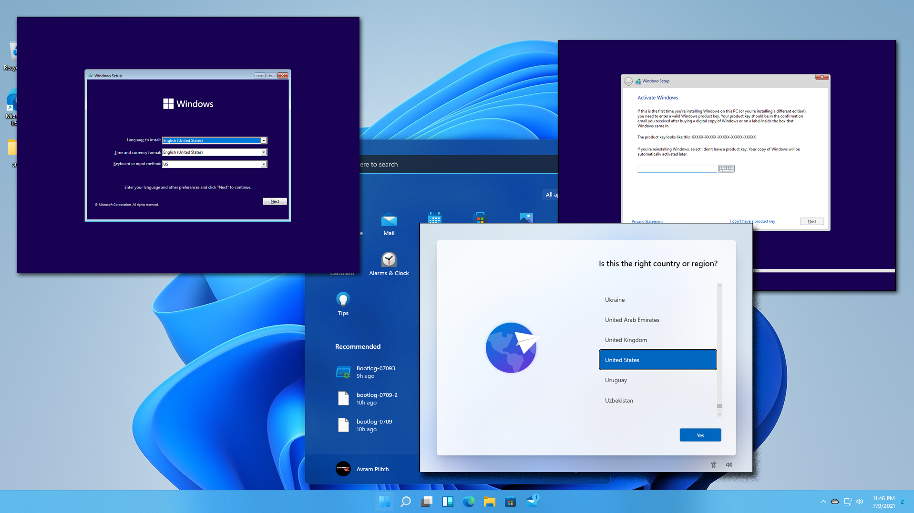
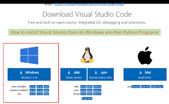
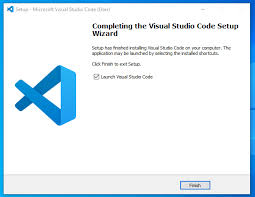

# Dev_Setup
Setup Development Environment

#Assignment: Setting Up Your Developer Environment

#Objective:
This assignment aims to familiarize you with the tools and configurations necessary to set up an efficient developer environment for software engineering projects. Completing this assignment will give you the skills required to set up a robust and productive workspace conducive to coding, debugging, version control, and collaboration.

#Tasks:

1. Select Your Operating System (OS):
   Choose an operating system that best suits your preferences and project requirements. Download and Install Windows 11. https://www.microsoft.com/software-download/windows11

1.Installing windows 11
Step 1: Create a bootable USB drive
Materials:
USB drive with at least 8GB of storage space
Windows 11 ISO file
Instructions:
Download the Windows 11 ISO file from Microsoft's website.
Use a tool like Rufus to create a bootable USB drive from the ISO file.

Step 2: Boot from the USB drive
Instructions:
Insert the USB drive into a USB port on the computer you want to install Windows 11 on.
Turn on the computer and press the key that is displayed on the screen to enter the BIOS settings.
In the BIOS settings, change the boot order so that the USB drive is the first boot device.
Save the changes and exit the BIOS settings.

Step 3: Start the Windows 11 installation
Instructions:
The computer will now boot from the USB drive.
Select your language, time and currency format, and keyboard input method.
Click "Next".

Step 4: Select the installation type
Instructions:
Choose "Install Now".

Step 5: Accept the license agreement
Instructions:
Select "I accept the license terms" and click "Next".

Step 6: Choose the installation type
Instructions:
Select "Custom: Install Windows only (advanced)".

Step 7: Select the hard drive
Instructions:
Select the hard drive where you want to install Windows 11.
Click "Next".

Step 8: Install Windows 11
Instructions:
The Windows 11 installation will now begin. This may take some time.

Step 9: Set up your user account
Instructions:
Once the installation is complete, you will be prompted to set up your user account.
Enter your username and password.
Click "Next".

Step 10: Configure your settings
Instructions:
You will now be asked to configure your settings, such as privacy, security, and updates.
Make your selections and click "Next".

Step 11: Finish the installation
Instructions:
Windows 11 will now finish the installation process.
Once the installation is complete, your computer will restart.

2. Install a Text Editor or Integrated Development Environment (IDE):
   Select and install a text editor or IDE suitable for your programming languages and workflow. Download and Install Visual Studio Code. https://code.visualstudio.com/Download

Step 1: Download the Visual Studio Code Installer
Visit the official Visual Studio Code download page: https://code.visualstudio.com/download
Choose the installer for your operating system (Windows, macOS, or Linux).

Step 2: Run the Installer
Once downloaded, run the installer.
Follow the on-screen instructions to complete the installation.
If prompted, accept any user agreements or privacy policies.

Step 3: Launch Visual Studio Code
After the installation is complete, you can launch Visual Studio Code from the Start menu (Windows), Applications folder (macOS), or terminal (Linux).

Step 4: Install Extensions (Optional)
Extensions enhance the functionality of Visual Studio Code.
To install extensions, open the Extensions Marketplace from the View menu.
Browse and search for extensions that meet your needs.
Click the "Install" button for extensions you want to add.

Step 5: Configure Your Settings (Optional)
To customize your Visual Studio Code environment, open the Settings tab from the File menu.
You can adjust settings such as theme, font size, keyboard shortcuts, and many more.

Step 6: Create a Workspace (Optional)
A workspace is a collection of files and folders that you work on within Visual Studio Code.
To create a workspace, click the "File" menu and select "Open Folder".
Navigate to the folder containing the files you want to work on.

3. Set Up Version Control System:
   Install Git and configure it on your local machine. Create a GitHub account for hosting your repositories. Initialize a Git repository for your project and make your first commit. https://github.com

Download the Git installer: Visit the official Git website (https://git-scm.com/downloads) and download the installer for your operating system.

Run the installer: Double-click on the downloaded installer and follow the on-screen instructions to install Git.
Configuring Git

Open Git Bash: Launch Git Bash by searching for it in your start menu or application launcher.
Set your username: Run the following command to set your Git username:
git config --global user.name "Your Name"

Set your email address: Run the following command to set your Git email address:
git config --global user.email "your@email.address"

Verify your settings: Run the following command to verify that your settings are properly configured:
git config --list
Additional steps for specific operating systems
Windows:

Enable line endings conversion: Open Git Bash and run the following command:
git config --global core.autocrlf input
macOS:

Install Xcode Command Line Tools: Xcode Command Line Tools are required for additional command-line utilities. Install them via the App Store.
Linux:
Install Git dependencies: Depending on your distribution, you may need to install additional dependencies. For example, on Ubuntu:
sudo apt install git-core

4. Install Necessary Programming Languages and Runtimes:
  Instal Python from http://wwww.python.org programming language required for your project and install their respective compilers, interpreters, or runtimes. Ensure you have the necessary tools to build and execute your code.

Windows:
Visit the Python download page: https://www.python.org/downloads/
Click on the latest stable Python version for Windows.
Run the downloaded executable file (e.g., "python-3.10.0-amd64.exe") and follow the installation wizard.
macOS:
Install the macOS Command Line Tools:
xcode-select --install
Install Homebrew:
/usr/bin/ruby -e "$(curl -fsSL https://raw.githubusercontent.com/Homebrew/install/master/install)"
Install Python using Homebrew:
brew install python
Linux:
Use your package manager to install Python:
Debian/Ubuntu:
sudo apt-get install python3
Fedora/Red Hat:
sudo yum install python3
CentOS/Rocky Linux:
sudo dnf install python3
Setting Up Python
Add Python to PATH (optional):
Open the system environment variables settings (e.g., System Preferences on macOS, Control Panel on Windows).
Add the following path to the PATH variable:
Windows:
C:\Python310
(assuming Python is installed in
C:\Python310
)
macOS/Linux:
/usr/local/bin
(if using Homebrew)
Install a Package Manager (optional):
Install Pip (Python package installer):
Windows:
pip install pip
macOS/Linux:
python -m pip install pip --user
Install Virtualenv (virtual environment manager):
pip install virtualenv
Create a Virtual Environment (optional):
Create a virtual environment for your project:
Windows:
python -m venv my_venv
macOS/Linux:
python3 -m venv my_venv
Activate the virtual environment:
Windows:
my_venv\Scripts\activate
macOS/Linux:
source my_venv/bin/activate

5. Install Package Managers:
   If applicable, install package managers like pip (Python).

. Check if Pip is Already Installed:
Open a command prompt or terminal window.
Type
pip --version

If Pip is already installed, the version will be displayed.
. Install Pip Using Get-Pip Script:
Windows:
Download the get-pip.py script from https://bootstrap.pypa.io/get-pip.py.
Open a command prompt as administrator.
Navigate to the directory where you downloaded the script.
Run
python get-pip.py
to install Pip.
macOS / Linux:
Open a terminal window.
Run
curl https://bootstrap.pypa.io/get-pip.py -o get-pip.py
to download the script.
Run
sudo python get-pip.py
to install Pip as root.
. Verify Installation:
Run
pip --version
again to check if Pip is installed and to display the version.
. Install pipx (Optional):
pipx is a tool that helps manage and install Python packages in isolated environments.
To install pipx, run
pip install pipx

. Set Environment Variables (Optional):
To use pipx globally, add the following to your shell configuration file (e.g.,
.bashrc
,
.zshrc
):
export PIPX_HOME="$HOME/.local/pipx"
export PATH="$PATH:$PIPX_HOME/bin"
. Upgrade Pip (Optional):
To upgrade Pip to the latest version, run
pip install --upgrade pip

6. Configure a Database (MySQL):
   Download and install MySQL database. https://dev.mysql.com/downloads/windows/installer/5.7.html
. Download the Installation File:
Visit the official website of the SQL database vendor (e.g., Microsoft for SQL Server, Oracle for Oracle Database, MySQL for MySQL)
Locate the download page for the specific version you want to install
Download the installation file (.exe, .tar.gz, etc.)
. Start the Installation Process:
Double-click on the installation file to launch the setup wizard
Follow the on-screen instructions
Select the target directory where you want to install the database software
. Choose the Installation Type:
Select the type of installation you want: full, custom, or express
The full installation installs all optional components, while the custom installation allows you to select specific features and components
. Configure the Database Instance:
Specify the name of the database instance (e.g., "MY_DATABASE")
Choose the database engine settings, such as the authentication mode and port number
. Create a Database User:
Create a database user and assign it a password
This user will be used to manage and access the database
. Install Additional Components (Optional):
If needed, install additional components or tools, such as the management studio or other utilities
. Configure the Firewall (Windows only):
If you are installing on Windows, you may need to configure the firewall to allow connections to the database server
. Start the Database Service:
Start the database service to make it available for use
Verify that the service is running smoothly
. Verify Installation:
Connect to the database using the user you created and check if you can execute queries and manage the database
Additional Notes:
The specific installation steps may vary slightly depending on the SQL database software you are using
If you encounter any issues during installation, refer to the official documentation or contact the vendor's support team
You may need additional privileges or permissions to complete the installation and configuration process

7. Set Up Development Environments and Virtualization (Optional):
   Consider using virtualization tools like Docker or virtual machines to isolate project dependencies and ensure consistent environments across different machines.

8. Explore Extensions and Plugins:
   Explore available extensions, plugins, and add-ons for your chosen text editor or IDE to enhance functionality, such as syntax highlighting, linting, code formatting, and version control integration.
Productivity Enhancements:
Productivity Power Tools: A comprehensive suite of tools for code navigation, formatting, code analysis, and other productivity-boosting features.
Resharper: A powerful IDE extension that provides code analysis, code navigation, unit testing, and a range of other tools to improve coding efficiency.
CodeMaid: Automates code cleanup tasks like formatting, code style enforcement, and removing unused code.
Visual Assist X: Enhances code editing with advanced auto-completion, context-sensitive help, and code refactoring tools.
Code Analysis and Debugging:
Code Analysis: Provides static code analysis tools to identify potential errors and code smells before compilation.
Roslynator: A code analysis tool that uses Roslyn to offer real-time code diagnostics and code generation features.
Live Unit Testing: Enables unit testing directly in the IDE, providing instant feedback on code changes.
Version Control Integration:
Azure DevOps Services: Integrates Visual Studio with Azure DevOps Services for source code management, task tracking, and continuous integration.
Git Integration: Provides seamless integration with Git, allowing developers to manage their Git repositories directly from the IDE.
TFVC Integration: Enables integration with Team Foundation Version Control (TFVC) to manage source code in a centralized repository.
Database Development:
SQL Server Data Tools (SSDT): A comprehensive suite of tools for designing, developing, testing, and deploying SQL Server databases.
Oracle Developer Tools for Visual Studio: Provides an integrated development environment for developing, debugging, and deploying Oracle databases.
PostgreSQL: Integrates PostgreSQL with Visual Studio, enabling database development and management from the IDE.
Other Extensions:
NuGet Package Manager: Manages NuGet packages for third-party libraries and frameworks.
EditorConfig: Enforces consistent code style and formatting across the team.
Window Resizer: Customizes window layout and resizing options for a more efficient workspace.
VsVim: Adds Vim-like keyboard shortcuts and commands to the Visual Studio editor.

Challenges during Software Development Environment Set-up:

Version Control Conflicts: Multiple developers working on the same codebase can lead to conflicts due to concurrent modifications.
Compatibility Issues: Incompatibility among different software versions (e.g., compiler, IDE, plugins) can hinder development.
Toolchain Integration: Setting up complex toolchains (e.g., testing frameworks, build systems) and ensuring compatibility with the environment.
Configuration Errors: Incorrect configuration of development tools can lead to build failures or runtime issues.
Resource Constraints: Limited resources (e.g., memory, processing power) can impact compilation times and debug performance.
Collaboration and Communication: Poor communication and coordination among developers can lead to misunderstandings and duplicate efforts.
Strategies to Overcome Challenges:

Version Control Best Practices: Establish clear version control guidelines, utilize branching and merging strategies, and implement conflict resolution mechanisms.
Version Compatibility Management: Use version managers (e.g., nvm, pipenv) to ensure consistent software versions across the team.
Toolchain Management: Choose compatible tools and use automation scripts to handle toolchain configuration and updates.
Automated Testing: Configure automated testing to detect and resolve build errors early in the development process.
Resource Provisioning: Provide adequate resources to meet compilation and debugging requirements.
Communication and Documentation: Establish regular communication channels, document setup instructions, and provide onboarding training for new developers.
Continuous Integration/Continuous Delivery (CI/CD): Implement a CI/CD pipeline to automate the development and deployment process, ensuring consistency and reliability.
Containerization: Utilize containers (e.g., Docker, Kubernetes) to create isolated and reproducible development environments.
Cloud-based IDEs: Consider using cloud-based IDEs (e.g., GitHub Codespaces) to provide a unified and accessible development environment.
Dedicated Teams: Assign specialized teams responsible for managing and maintaining development environments.

9. Document Your Setup:
    Create a comprehensive document outlining the steps you've taken to set up your developer environment. Include any configurations, customizations, or troubleshooting steps encountered during the process. 

#Deliverables:
- Document detailing the setup process with step-by-step instructions and screenshots where necessary.
- A GitHub repository containing a sample project initialized with Git and any necessary configuration files (e.g., .gitignore).
- A reflection on the challenges faced during setup and strategies employed to overcome them.

#Submission:
Submit your document and GitHub repository link through the designated platform or email to the instructor by the specified deadline.

#Evaluation Criteria:**
- Completeness and accuracy of setup documentation.
- Effectiveness of version control implementation.
- Appropriateness of tools selected for the project requirements.
- Clarity of reflection on challenges and solutions encountered.
- Adherence to submission guidelines and deadlines.

Note: Feel free to reach out for clarification or assistance with any aspect of the assignment.
